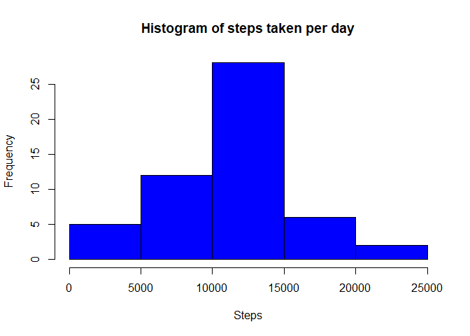
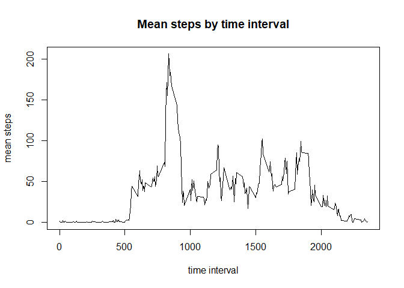
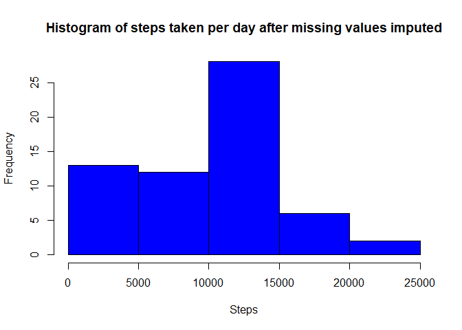
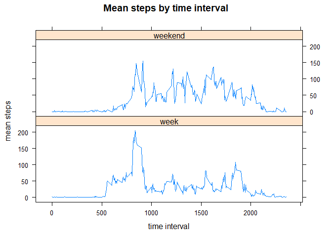

```r
library(dplyr)
```

```
## 
## Attaching package: 'dplyr'
```

```
## The following objects are masked from 'package:stats':
## 
##     filter, lag
```

```
## The following objects are masked from 'package:base':
## 
##     intersect, setdiff, setequal, union
```

## Loading and preprocessing the data
Raw data download:

```r
temp <- tempfile()
zipfile  <- "https://d396qusza40orc.cloudfront.net/repdata%2Fdata%2Factivity.zip"
download.file(zipfile,temp)
dta_raw <- read.csv(unz(temp, "activity.csv"))
unlink(temp)
```
Preprocessing:

```r
## Convert date variable from factor to date
dta_raw$date <- as.Date(dta_raw$date)

## Sum total steps for each date
steps_date <- aggregate(dta_raw$steps, by=list(date=dta_raw$date), FUN=sum)
```

## What is mean total number of steps taken per day?

```r
hist(steps_date$x, main="Histogram of steps taken per day", xlab="Steps", col="blue")
```

<!-- -->

```r
meansteps <- round(mean(steps_date$x,na.rm=TRUE),4)
mediansteps <- median(steps_date$x,na.rm=TRUE)
```

The mean steps taken per day was 10766
The median steps taken per day was 10765


```r
## Time series plot of the average number of steps taken
steps_time <- aggregate(dta_raw$steps, by=list(interval=dta_raw$interval), FUN=mean, na.rm=TRUE)

plot(steps_time$interval,steps_time$x,type="l",main="Mean steps by time interval", xlab="time interval",ylab="mean steps")
```

<!-- -->

```r
intervalmax <- steps_time[steps_time$x==max(steps_time$x),1]
```

The 5-minute interval that, on average, contains the maximum number of steps, is 835


## Missing data
Assuming that activity levels by time interval shows similar patterns across days, replace missing values with median number of steps for that time interval calculated across all other days

Total number of missing entries in the dataset is 2304


```r
## for imputing missing data, loop over each time interval, calculate median value from nonmissing results, and replace missing values with median.

## Calculate and report the total number of missing values in the dataset 
navals <- sum(is.na(dta_raw$steps))

## generate list of median values for imputation
med_impute <- aggregate(dta_raw$steps, by=list(interval=dta_raw$interval), FUN=median, na.rm=TRUE)

dta_impute <- dta_raw

for(i in 1:nrow(dta_impute)){
  if(is.na(dta_impute$steps[i])) {
    dta_impute$steps[i] <- med_impute$x[match(dta_impute$interval[i], med_impute$interval)]
  }
}
```


## Histogram of the total number of steps taken each day after missing values are imputed

```r
## Sum total steps for each date
steps_date_imp <- aggregate(dta_impute$steps, by=list(date=dta_impute$date), FUN=sum)

hist(steps_date_imp$x, main="Histogram of steps taken per day after missing values imputed", xlab="Steps", col="blue")
```

<!-- -->

```r
meansteps_imp <- mean(steps_date_imp$x,na.rm=TRUE)
mediansteps_imp <- median(steps_date_imp$x,na.rm=TRUE)
```

After imputation, the revised mean number of steps taken is 9503, and the revised median number of steps is 10395

## Are there differences in activity patterns between weekdays and weekends?
Panel plot comparing the average number of steps taken per 5-minute interval across weekdays and weekends


```r
## Time series plot of the average number of steps taken at weekdays and weekends
## Add variable giving weekday or weekend
library(dplyr)

dta_week <- 
  dta_impute %>%
  mutate(daynum = as.POSIXlt(date)$wday) %>%
  mutate(day = if_else(daynum==0 | daynum==6,"weekend",
         if_else((daynum>0 & daynum<6), "week", "unknown" )))

dta_week$day <- as.factor(dta_week$day)

steps_time_wk <- aggregate(dta_week$steps, by=list(wkdy=dta_week$day,interval=dta_week$interval), FUN=mean, na.rm=TRUE)

WEEK = steps_time_wk[steps_time_wk$wkdy == "week", ]
WEEKEND = steps_time_wk[steps_time_wk$wkdy == "weekend", ]

library(lattice)
xyplot(x ~ interval | wkdy, data=steps_time_wk, type="l",layout=c(1,2), main="Mean steps by time interval", xlab="time interval", ylab="mean steps")
```

<!-- -->

```r
intervalmax <- steps_time[steps_time_wk$x==max(steps_time$x),1]
```
